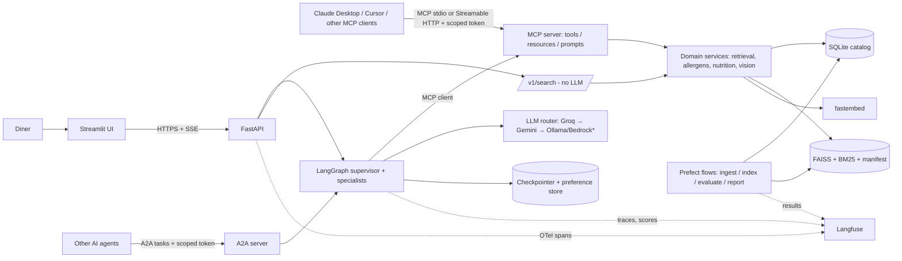
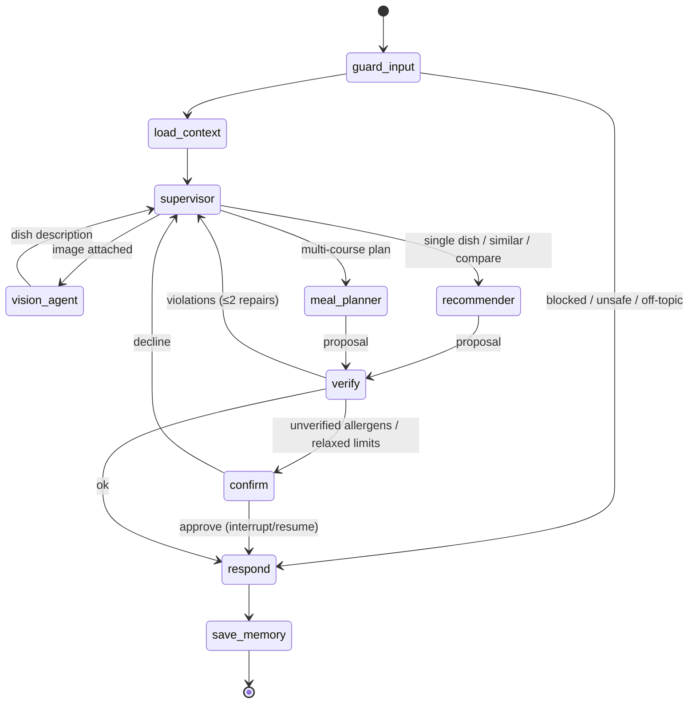

# Architecture — Multi-Agent Food Concierge (MCP)

> Living document. *How* the system is built. Requirements: `prd.md`. Rules: `engineering-rules.md`. Revision 3 (2026-09-24): multi-agent supervisor, A2A, reranker + Qdrant, Prefect, guardrails/access control, Responsible AI (§14–17).

---

## 1. Decisions at a glance

| Concern | Decision | Why (business / portfolio) |
|---|---|---|
| Orchestration | **LangGraph** supervisor + specialist subgraphs | Multi-step meal planning needs routing, loops, checkpoints and human-in-the-loop interrupts; LangGraph is the most requested agent framework. CrewAI/AutoGen rejected (ADR): less control over state and interrupts. |
| Agent interop | **A2A** (`a2a-sdk`): Agent Card + task API | MCP = agent↔tool; A2A = agent↔agent. Lets other agents delegate meal planning. |
| Workflow orchestration | **Prefect** (OSS, local) + GitHub Actions schedule | Ingestion → index → eval → report as observable, retryable flows. Temporal/Airflow rejected (ADR): durable long-running workflows and cluster ops are unnecessary here. |
| Tool protocol | **MCP** (official Python SDK), stdio + Streamable HTTP | Tools become reusable by any MCP client (Claude Desktop, Cursor, other agents), not locked inside one app |
| Safety | Constraints enforced **in tools and a deterministic verifier node** | 20/50 unlabelled + 14/50 description-only allergens; an LLM can't be the safety layer |
| Hosted LLM | **Groq** (primary) → **Gemini** (fallback), both free tiers via OpenAI-compatible endpoints | $0, fast, resilient to one quota running out |
| Local LLM | **Ollama** (llama3.1:8b chat, Qwen2.5-VL 7B vision) | Free development, offline evaluation, LLM-as-judge |
| Bedrock | `langchain-aws` provider, **stub-tested only**, off by default | Shows AWS integration without spend |
| Embeddings | **fastembed** `BAAI/bge-small-en-v1.5` (ONNX, 384-d) in-process | $0, no torch, same model in dev, CI and prod, so indexes never mismatch |
| Vector search | FAISS `IndexIDMap2(IndexFlatIP)` + **BM25** + hybrid RRF + **cross-encoder reranker**; **Qdrant** (local mode) as a benchmarked alternative backend | FAISS is in the brief; the lexical baseline is required by the audit; the reranker and Qdrant are adopted only on evidence |
| Metadata / state | SQLite (catalog, allergens, LangGraph checkpoints, preference store, cache) | Zero-cost, file-based, rebuildable |
| LLMOps | **Langfuse** (free Hobby cloud for the demo; self-host via Docker locally) | Traces, prompt registry, datasets, experiments, scores; durable storage off the ephemeral host |
| Guardrails | Local injection classifier (ONNX) + spotlighting + content-safety model + deterministic verifier | Defence in depth; nothing safety-critical depends on the LLM |
| Access control | Scoped bearer tokens (`public` / `agent` / `admin`) on MCP, A2A and API; per-agent tool allow-lists | Least privilege for tools and agents |
| Serving | FastAPI (SSE streaming) + Streamlit client | Typed API; thin UI |
| Hosting | **Hugging Face Spaces** (Docker: API + MCP) + **Streamlit Community Cloud** (UI) | Free, no card |
| CI/CD | GitHub Actions: lint, tests, security scans, eval gates, deploy to HF Space | Free for public repos |

## 2. System context


`*` Ollama is local only; Bedrock is off by default and stub-tested.

**Layering rule:** domain services (pure Python, no LLM framework imports) ← MCP server (protocol adapter) ← agent (MCP client). The agent never imports domain services directly. Everything it does goes through MCP, which keeps the protocol real and the tools reusable.

## 3. Offline ingestion pipeline

`python -m food_concierge.ingestion build` — idempotent, manifest-bound.

1. **Load and validate** `data/raw/menu.csv` and `data/raw/attributions.csv` (pydantic row schemas; report every bad row; every image must have a licence record).
2. **Normalise:**
   - `serves` → `serves_min/max`.
   - `cuisine` → cuisine + category (`Pizza`, `Fast Food`, `Sandwiches`, `Vegan` are categories).
   - Diet: `vegan`, `vegetarian` (lacto-ovo), `non_vegetarian`, plus an `contains_egg` flag that drives the `eggless` filter.
   - Nutrition consistency check (Atwater 4P+4C+9F; > 25% deviation → ingestion warning).
3. **Allergens (EU-14 ∪ US Big-9)** from three sources, each tag stored with `source` and `level`:
   - `label`: parsed `dietary_warnings` → level `contains`.
   - `lexicon`: ingredient terms (`flour|bread|bun|croutons|tortilla|soy sauce → gluten`, `cheese|cream|butter|ghee|yogurt → milk`, `crab|shrimp → crustaceans`, `almond|cashew → tree_nuts`…) → `contains`.
   - `vision`: allergen terms found in the image description → `may_contain`.
   - Opaque ingredients (`vegan dressing`, `plant-based patty`, `spices`, `spring roll wrappers`) → `unverified = 1`.
4. **Descriptions:** generated with the local Ollama vision model ($0) for new/changed images only, cached by sha256 in `data/processed/image_descriptions.jsonl`. A **name-free** description variant is generated with local Ollama (free) for the evaluation in Phase 3 (audit #7).
5. **Thumbnails:** WebP ≤ 480 px (RGBA → RGB) for UI and MCP image resources.
6. **Document text (semantic only):** description + dish name + cuisine + ingredients + diet. Numbers stay in SQL (audit #14).
7. **Indexes:** fastembed vectors → FAISS (`IndexIDMap2(IndexFlatIP)`, ids = `item_rowid`); BM25 over the same text; `manifest.json` {embedder, dim, n_items, data_sha256, doc_text_version, created_at}.
8. **Duplicates:** the same dish at several restaurants is grouped by `dish_key` so results de-duplicate (audit #13).

## 4. Domain services (`food_concierge/services/`)

Pure functions and classes, no LLM framework imports; the single source of business logic.

| Service | Responsibility | Complexity |
|---|---|---|
| `catalog` | SQLite reads; `candidate_ids(constraints)` | Indexed SQL, O(log N + \|C\|) |
| `retrieval` | `VectorStore` protocol with FAISS and Qdrant (local mode, payload filters) backends; BM25; hybrid RRF; optional cross-encoder rerank of top-20; de-duplication | O(\|C\|·d) exact; HNSW behind the same interface beyond ~10⁵ items |
| `allergens` | Tag lookup; `check(dish_ids, allergens)` → contains / may_contain / unverified | O(k) |
| `nutrition` | `meal_totals(dish_ids)`: calories, macros, price, serves | O(k) exact arithmetic |
| `constraints` | Parse, merge (allergens: union; caps: min; diet: strictest) and **verify** a proposal | O(k) |
| `vision` | Validate image (Pillow), downscale, re-encode, describe via vision model, cache by sha256 | 1 LLM call, cached |

## 5. MCP server (`food_concierge/mcp_server/`)

Built with the official `mcp` Python SDK (FastMCP). Transports: **stdio** (Claude Desktop, MCP Inspector) and **Streamable HTTP** mounted at `/mcp` in the FastAPI app.

**Tools** (typed input/output schemas; read-only; idempotent; constraints enforced inside):

| Tool | Input → Output |
|---|---|
| `search_dishes` | query, diet?, exclude_allergens[], eggless?, max_calories?, max_price?, cuisine[]?, exclude_ids[], k≤10 → ranked `DishSummary[]` (never returns a violating dish) |
| `find_similar` | dish_id, same constraints, k → `DishSummary[]` |
| `get_dish` | dish_id → `DishDetail` (nutrition, ingredients, allergen tags with source/level, restaurants) |
| `check_allergens` | dish_ids[], allergens[] → per dish {contains[], may_contain[], unverified} |
| `meal_totals` | dish_ids[] → {calories, protein_g, carbs_g, fats_g, price_usd} |
| `describe_image` | image (base64, ≤ 5 MB) → dish description (uses the vision model; rate-limited) |

**Resources:** `menu://catalog` (compact list), `menu://dishes/{id}` (JSON), `menu://dishes/{id}/image` (WebP), `menu://policy/allergens` (taxonomy + disclaimer).
**Prompts:** `plan_meal(constraints)`, `find_similar_dish(description)`.
**Errors:** domain errors are returned as tool results with `isError=true` and a safe message, so the agent can recover. Protocol errors are for malformed calls only.
**Security:** read-only tools; input size limits; HTTP transport rate-limited; no filesystem or network side effects. OAuth 2.1 (per the MCP auth spec) is backlog.
**Testing:** in-memory client–server sessions (no network); schema snapshot tests; MCP Inspector for manual checks; a Claude Desktop config example in `docs/mcp.md`.

## 6. Agents (`food_concierge/agent/`) — LangGraph supervisor + specialists



| Node / agent | Kind | Tools (allow-list, via MCP) | Notes |
|---|---|---|---|
| `guard_input` | deterministic + classifiers | none | size limits, injection classifier, content-safety screen, off-topic routing |
| `load_context` | deterministic | none | load thread state, recall stated preferences (semantic), summarise/trim long threads |
| `supervisor` | LLM router | none | structured `Route` output (Pydantic); routes to one specialist at a time; bounded hops |
| `vision_agent` | LLM (vision) | `describe_image` | the only agent allowed to use the vision tool |
| `recommender` | ReAct subgraph | `search_dishes`, `find_similar`, `get_dish` | ends with a structured `Proposal` |
| `meal_planner` | ReAct subgraph | `search_dishes`, `get_dish`, `check_allergens`, `meal_totals` | plans courses under limits; ends with a `Proposal` |
| `verify` | **deterministic** | calls services via MCP | constraints, totals, grounding, numeric-claim checks; the safety gate |
| `confirm` | `interrupt()` | none | human-in-the-loop |
| `respond` | LLM (or template) | none | writes the answer from verified facts only |
| `save_memory` | deterministic | none | persists explicitly stated preferences |

- **Least privilege:** each specialist is bound only to its allow-listed tools. A call outside the list is rejected and logged as a security event.
- **Budgets:** ≤ 8 tool calls and ≤ 4 supervisor hops per request; ≤ 2 repair loops; the LangGraph recursion limit as a backstop.
- **Memory:**
  - *Short-term:* SQLite checkpointer keyed by `thread_id`.
  - *Long-term:* LangGraph store namespace `("prefs", user_id)` with fastembed-indexed items for semantic recall.
  - *Contextual:* summarisation node when a thread exceeds a token budget, plus `trim_messages` on every turn.
- **Model router:** `ChatOpenAI(base_url=…)` for Groq / Gemini / Ollama with `.with_fallbacks`; `ChatBedrockConverse` behind the paid flag. Model choice is configurable per node (e.g. a small model for the supervisor).
- **Ablation:** a `single_agent` graph (one ReAct agent with all read tools and the same verifier) is kept for the Phase 6 comparison. The default is whichever wins on success at acceptable latency and tokens.

## 7. LLMOps

| Capability | Implementation |
|---|---|
| Tracing | Langfuse (SDK is OpenTelemetry-based) via LangChain callback + manual spans for API, MCP tool handlers and verifier; `trace_id` returned in every API response |
| Metadata on traces | prompt version, model, provider, fallback used, tool calls, step count, verifier result, user feedback |
| Token and "shadow cost" | Tokens from provider usage; shadow cost = tokens × a reference paid price table (config), to show what production would cost |
| Prompt registry | Prompts live in `food_concierge/prompts/*.yaml` (source of truth, reviewed in PRs); `scripts/sync_prompts.py` pushes versions to Langfuse; runtime reads the local copy (no network dependency) |
| Datasets | `eval/datasets/*.yaml` versioned in git, mirrored to Langfuse datasets |
| Experiments | `eval/run.py` runs a dataset against a config (model, prompt version, retrieval mode) and logs scores to Langfuse + `eval/results/*.json` |
| Retrieval eval | nDCG@3, Success@3, Recall@k (narrow queries), Violation@3; baselines: legacy index replay, BM25, dense, hybrid |
| Agent eval | task success, constraint violations (target 0), tool-selection accuracy vs expected tools, steps, repair loops, latency; trajectory assertions |
| LLM-as-judge | Local Ollama judge for helpfulness/faithfulness of explanations; **calibrated on ~40 human-labelled examples (Cohen's κ reported)** before use |
| CI gates | (1) offline tests; (2) **retrieval gate** from committed embedding caches, which fails if nDCG@3 drops > 0.02 or any violation appears; (3) agent scenario tests with a scripted fake LLM (trajectory + verifier behaviour). Live-model evals are run manually and results committed. |
| Online monitoring | Langfuse dashboards: latency, error and fallback rate, tokens, feedback scores; weekly review noted in `docs/runbook.md` |
| Guardrails | Input classifiers, spotlighting, tool access control, output verifier: see §16. Red-team attack success rate is tracked as an eval metric. |

## 8. API (FastAPI)

| Method | Path | Purpose |
|---|---|---|
| GET | `/health`, `/ready` | Liveness; catalog + index + manifest consistent |
| POST | `/v1/agent/runs` | Start/continue a conversation (`thread_id`, message, optional image); **SSE stream** of tokens, tool events, interrupt requests, final answer; returns `trace_id` |
| POST | `/v1/agent/runs/{thread_id}/resume` | Resume after an interrupt (approve/decline) |
| POST | `/v1/search` | Retrieval-only (no LLM), same constraints |
| GET | `/v1/dishes/{id}`, `/static/thumbs/{file}` | Detail, thumbnails |
| POST | `/v1/feedback` | `{trace_id, score, comment?}` → Langfuse score |
| * | `/mcp` | MCP Streamable HTTP transport (scoped token) |
| GET | `/.well-known/agent-card.json` | A2A Agent Card |
| * | `/a2a` | A2A task endpoints (send, stream, get, cancel; scoped token) |

Errors: `{"error": {"code", "message", "request_id", "trace_id"}}`, mapped from `food_concierge.errors` (422 / 429 / 502 / 503 / 504). Middleware: request ID, CORS (UI origin), per-session and global token-bucket rate limits, body-size limit.

## 9. Configuration and secrets

`pydantic-settings`; `.env` locally; HF Space secrets and Streamlit secrets in production. Keys: `GROQ_API_KEY`, `GEMINI_API_KEY`, `LANGFUSE_PUBLIC_KEY`, `LANGFUSE_SECRET_KEY`, `LANGFUSE_HOST`, `API_TOKEN_PUBLIC` / `API_TOKEN_AGENT` / `API_TOKEN_ADMIN`; optional `AWS_*` (Bedrock, off), `OPENAI_API_KEY` (off). `.env.example` lists every key and a test checks it against `Settings`; unknown keys in `.env` are rejected at startup. Model names, fallback order, budgets and limits are all settings. Free-tier model names are verified at implementation time and recorded in an ADR.

## 10. Zero-cost guardrails

| Risk | Guardrail |
|---|---|
| Accidental paid usage | Paid providers (OpenAI, Bedrock) disabled unless `ALLOW_PAID_PROVIDERS=true`; CI asserts the default config has no paid provider |
| Free quota exhaustion | Fallback chain → retrieval-only answer; per-session + global rate limits; `describe_image` limited separately |
| Services needing a card | Rule: none. Hosting = HF Spaces + Streamlit Community Cloud; tracing = Langfuse Hobby; CI = GitHub Actions |
| Image/container bloat | fastembed ONNX (no torch); thumbnails only in the image; model files cached at build |

## 11. Deployment

| Component | Where | Notes |
|---|---|---|
| API + MCP (HTTP) | Hugging Face Space (Docker SDK, free CPU) | Sleeps when idle, cold start on wake; ephemeral disk (catalog/index baked in at build; checkpoints are demo-only) |
| UI | Streamlit Community Cloud | Calls the Space URL; secrets in Streamlit settings |
| MCP (stdio) | Local: `uvx`/`python -m food_concierge.mcp_server` | Claude Desktop config in `docs/mcp.md` |
| Tracing | Langfuse Cloud Hobby (demo), Docker Compose self-host (dev) | Durable traces/scores/datasets |
| CI/CD | GitHub Actions → push to HF Space on tag | Lint, tests, gitleaks, pip-audit, eval gates, docker build |

## 12. Folder structure

```
multi-agent-food-concierge-mcp/
├── README.md  pyproject.toml  requirements.lock  .env.example  docker-compose.yml (Langfuse, dev)
├── src/food_concierge/
│   ├── config.py  errors.py  logging_setup.py  telemetry.py
│   ├── models/          # router: Groq/Gemini/Ollama (OpenAI-compatible), Bedrock (stubbed), fake; fastembed wrapper
│   ├── ingestion/       # loader, normalize, allergens, describe, thumbnails, build, fetch_images
│   ├── storage/         # sqlite catalog, schema.sql, cache
│   ├── services/        # catalog, retrieval, allergens, nutrition, constraints, vision  (no LLM imports)
│   ├── mcp_server/      # FastMCP server: tools, resources, prompts; __main__ (stdio)
│   ├── agent/           # LangGraph: supervisor, specialists, verifier, memory, single-agent baseline
│   ├── guardrails/      # injection classifier, content safety, spotlighting, output checks
│   ├── security/        # token scopes, tool allow-lists, audit events, trace masking
│   ├── a2a_server/      # Agent Card, task executor wrapping the graph
│   ├── flows/           # Prefect flows: ingest, build_index, evaluate, report
│   ├── prompts/         # versioned YAML prompts + loader
│   └── api/             # FastAPI app, routes, SSE, middleware
├── frontend/            # Streamlit client (api_client, components, .streamlit/config.toml)
├── eval/                # datasets/, run.py, judge/, gates/, results/, caches/
├── scripts/             # sync_prompts.py, build_eval_cache.py
├── tests/               # unit/, mcp/, agent/, api/ (offline)
├── deploy/              # Dockerfile, hf-space/README.md (Space config), streamlit notes
├── examples/            # a2a_client_agent.py (demo peer agent), claude_desktop_config.json
├── docs/                # planning/, adr/, responsible-ai/ (system card, fairness, red-team), data-card.md, evaluation.md, mcp.md, a2a.md, runbook.md
├── data/                # raw/ (own catalog + attributions, tracked), processed/ (descriptions tracked; db/index/thumbs built)
└── private/             # git-ignored local material (course baseline, notes); never committed
```

## 13. Tech stack

| Layer | Choice |
|---|---|
| Language | Python 3.11 |
| Agent | `langgraph`, `langgraph-checkpoint-sqlite`, `langchain-core`, `langchain-openai` (OpenAI-compatible: Groq, Gemini, Ollama), `langchain-aws` (Bedrock, stubbed), `langchain-mcp-adapters` |
| Protocol | `mcp` (official SDK, FastMCP) |
| Retrieval | `faiss-cpu`, `qdrant-client` (local mode), `fastembed` (embeddings + cross-encoder rerank), `rank-bm25`, `numpy`, SQLite |
| Interop | `a2a-sdk` |
| Workflows | `prefect` (OSS) |
| Guardrails | `onnxruntime` + `tokenizers` + `huggingface-hub` (local injection classifier); Llama Guard-class model via Ollama (dev) / free tier if available |
| LLMOps | `langfuse` (OTel-based SDK) |
| API / UI | FastAPI, Uvicorn, `sse-starlette`, Pydantic v2; Streamlit |
| Images | Pillow |
| Quality | pytest, respx, botocore Stubber, ruff, mypy, gitleaks, pip-audit |
| Infra | Docker, GitHub Actions, Hugging Face Spaces, Streamlit Community Cloud |

## 14. A2A interoperability (`food_concierge/a2a_server/`)

- **Agent Card** at `/.well-known/agent-card.json`: name, description, version, skills (`recommend_dishes`, `plan_meal`) with input/output modes (text, image), capabilities (streaming), and the auth scheme (bearer, scope `agent`).
- **Task executor** wraps the LangGraph graph. A2A task states map to graph events (working → input-required on `interrupt` → completed/failed). Artifacts carry the verified proposal (JSON) and a text answer.
- **Demo peer:** `examples/a2a_client_agent.py`, a small "fitness coach" agent that discovers the card and delegates a meal plan with calorie targets. It shows agent↔agent delegation next to MCP agent↔tool use.
- **Tests:** in-process A2A client against the server with the fake model; card schema snapshot. The spec/SDK version is pinned and verified at implementation.

## 15. Workflow orchestration (`food_concierge/flows/`) — Prefect

| Flow | Tasks | Trigger |
|---|---|---|
| `ingest` | validate → normalise → allergens → describe new images (cached) → catalog | manual / data change |
| `build_index` | embed → FAISS + Qdrant + BM25 → manifest | after `ingest` |
| `evaluate` | retrieval eval → gates → Langfuse experiment | after `build_index`; nightly |
| `report` | render `docs/evaluation.md` tables + Responsible AI metrics | after `evaluate` |

Tasks retry on transient failures and are cached by input hash (unchanged data → skipped). Flows run locally (`prefect server start` for the UI) and on a **GitHub Actions nightly schedule** (free; no live LLM calls; the fastembed model download is allowed in scheduled jobs only). No Prefect Cloud dependency.

## 16. Guardrails, access control and data governance

| Layer | Control |
|---|---|
| Input | size/type limits; **injection classifier** (local ONNX model; candidate chosen for licence and size at implementation); **content-safety** screen (Llama Guard-class); off-topic routing |
| Untrusted text | "Spotlighting": catalog text, tool outputs and image descriptions are wrapped in marked data blocks, and system prompts state that data blocks carry no instructions |
| Tools | per-agent allow-lists; MCP/A2A **scoped tokens** (`public`: search and read resources; `agent`: + `describe_image` and agent runs; `admin`: ingestion flows); rate limits per token and global |
| Output | deterministic verifier; numeric-claim check; allergen disclaimer; AI-interaction disclosure |
| Audit | every tool call is a Langfuse span with caller scope and agent; denied calls are logged as security events |
| Governance | trace **masking** (image bytes, emails, phone numbers) via the Langfuse mask hook; uploads never stored; preferences viewable and deletable; data lineage via manifests (data hash → index → eval run); `docs/data-card.md` |
| Red-team | `eval/datasets/redteam.yaml`: direct and indirect injection (e.g. a poisoned dish description in a fixture catalog), tool-escalation attempts, allergen-override attempts. Metric: attack success rate (CI gate). |

## 17. Responsible AI (`docs/responsible-ai/`)

| Assessment | Method | Metric |
|---|---|---|
| Restaurant exposure fairness | Over the query set, compare each restaurant's share of top-3 exposure with its share of relevant items | exposure/relevance ratio per restaurant; max disparity |
| Popularity bias | Rank vs rating, controlling for relevance grade | partial correlation; effect of the rating tie-breaker |
| Counterfactual consistency | Paired requests that differ only in cultural or identity cues | safety-outcome agreement (target 100%); top-3 Jaccard |
| Confusion matrices | Allergen tagger vs hand labels; supervisor routing vs expected route; injection classifier on red-team + benign sets | per-class precision/recall, TPR/FPR |
| Complexity profile | Steps, tool calls, tokens and latency per task type; single vs multi-agent | distributions + p95 |
| Compliance mapping | Each obligation mapped to its control (AI-interaction disclosure, allergen information caveat, data minimisation and deletion) | table; explicitly "engineering mapping, not legal advice" |

Output: `system-card.md` (intended use, users, limitations, risks, mitigations, evaluation results, known failure modes), organised by the NIST AI RMF functions Govern / Map / Measure / Manage. This is the public equivalent of an internal AI review board ("AIRB") assessment.
